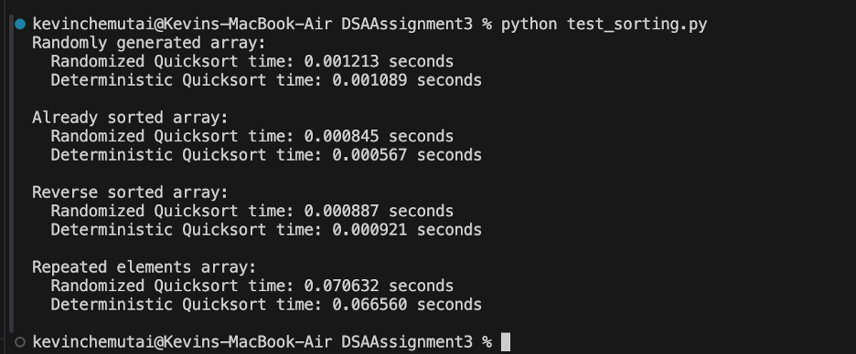
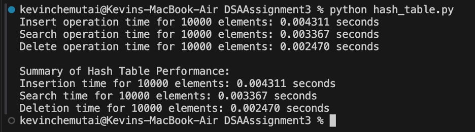

# DSAAssignment3

Assignment 3: Understanding Algorithm Efficiency and Scalability

Part 1: Randomized Quicksort Analysis

1. Implementation
   Code implementation in the GitHub Repo: https://github.com/kchemutai/DSAAssignment3/blob/main/randomized_quick_sort.py
2. Average-Case Time Complexity Analysis
   In Randomized Quicksort, a random choice of a pivot element within the array or subarray being sorted avoids the worst case since, in deterministic quicksort, it keeps happening that the pivot splits the array very unevenly.
3. Recurrence Relation: Let us assume that on every level of recursion, the randomized quicksort will split the array into two halves exactly on a chosen pivot.

- In the average case, the pivot will split the array into two subarrays of roughly equal size.
- The recurrence for the average time T(n) to sort an array of length n is given by

T(n)=T(n/2) +T(n/2) +O(n)

Which, simplifies to:
T(n)=2T(n/2) +O(n)

2. Solving the Recurrence:
   Using the Master Theorem or otherwise, we see this recurrence gives T(n)=O (n log n) T(n).
   This is because for every level of recursion O(n) work is done by partitioning the array and there are O (log n) levels at every recursive call given that the array is divided in half at each call.
3. Expected Cost Using Indicator Random Variables:
   Another way to analyze average case is using indicator random variables representing the cost for comparing each pair of elements during the sort.
   Let X ij be an indicator random variable that is 1 if elements I and j are compared and 0 otherwise.
   By summing over all pairs, we can compute the expected number of comparisons as
   E [∑ I < j X ij] = O (n log n) which will confirm that the average number of comparisons is proportional to n log n.
   Why Average-Case Complexity is O (n log n)

- Randomized pivot selection makes it likely to partition the array into two reasonably balanced parts and avoid an unbalanced split that would lead to O(n^2) complexity.
- Partitioning cost is O(n) at each level of recursion tree, whose depth is O (log n) hence the overall complexity is O (n log n).
  Hence, the above analysis confirms that Randomized Quicksort indeed meets its average-case time complexity of O (n log n) since it ensures that the balanced partitioning is coupled with an efficient recursive structure.

3. Comparison
   Here are the results after running the 2 algorithms randomly.
   
   Randomized Array: Both Randomized and Deterministic Quicksort had similar times, about 0.001 seconds, as they are both expected to perform in O (n log n) on average in the case of random data.
   Already Sorted Array: Deterministic Quicksort was marginally faster than Randomized Quicksort. In its deterministic version, the median-of-three pivot selection provides a method for optimizing such sorted data and avoiding possible inefficiency.
   Reverse-Sorted Array: The running times of the two algorithms were very close: about 0.0009 seconds each. Again, the deterministic Quicksort using the median-of-three method, avoided the worst case and got good, balanced partitions. The Randomized Quicksort chose a random pivot and hence the worst case was excluded and balanced partitions were obtained.
   Repeated Elements Array: Both algorithms took considerably longer, around 0.07 seconds, with the Deterministic Quicksort being marginally quicker.
   In both cases, the presence of repeated elements slowed them down substantially due to poor partitioning. However, in the case of Deterministic Quicksort, the median-of-three pivot was usually able to keep the partitioning relatively balanced.

Key Insight

Both algorithms coped equally well with different types of arrays, even though deterministic quicksort coped a bit better for already sorted and repeated element arrays because of better choice of pivots. Randomized quicksort demonstrated almost the same level of performance in all array types.

Part 2: Hashing with Chaining

1. Implementation
   Here is the GitHub implementation of the Hash Table: https://github.com/kchemutai/DSAAssignment3/blob/main/hash_table.py

2. Analysis
   
   Summary

3. Expected Operation Times: With a low load factor and simple uniform hashing, hash table operations (insert, search, and delete) generally take O (1) time on average. This is because each slot has a short chain, keeping operations efficient.
4. Impact of Load Factor: The load factor (ratio of elements to slots) directly affects performance. A high load factor leads to longer chains, slowing down operations and potentially degrading performance to O(n). Keeping the load factor low (typically below 0.7) helps maintain efficient operations.
5. Strategies to Maintain Efficiency:
   o Dynamic Resizing: Increase the table size when the load factor grows, and rehash elements to evenly distribute them across the table, reducing chain length.
   o Effective Hash Function: Use a well-distributed hash function to minimize collisions and ensure even key distribution.
   o Alternative Collision Handling: Consider advanced techniques like open addressing or cuckoo hashing to handle collisions efficiently.
   By managing the load factor and using effective hashing techniques, a hash table can maintain close to constant-time performance for insertions, searches, and deletions, even as it grows.
